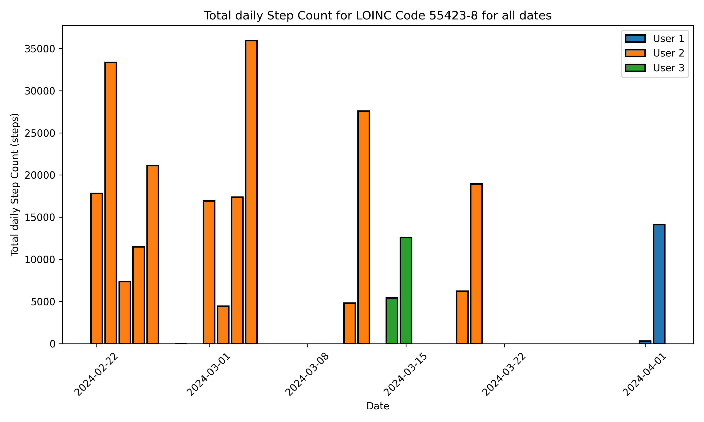
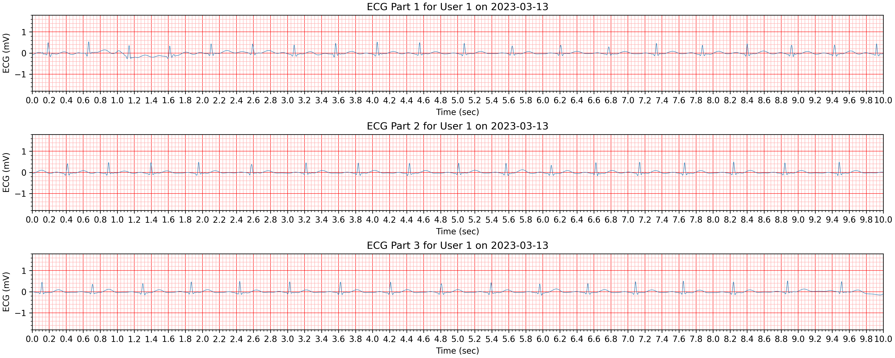

<!--

This source file is part of the Stanford Spezi open-source project.

SPDX-FileCopyrightText: 2024 Stanford University and the project authors (see CONTRIBUTORS.md)

SPDX-License-Identifier: MIT

-->

# Spezi Data Pipeline Template

[](https://github.com/StanfordSpezi/SpeziDataPipelineTemplate/actions/workflows/build-and-test.yml)
[](https://codecov.io/gh/StanfordSpezi/SpeziDataPipelineTemplate)
<a target="_blank" href="https://colab.research.google.com/github/StanfordSpezi/SpeziDataPipelineTemplate/blob/main/SpeziDataPipelineTemplate.ipynb">

</a>

The Spezi Data Pipeline offers a comprehensive suite of tools designed to facilitate the management, analysis, and visualization of healthcare data from Firebase Firestore. By adhering to the Fast Healthcare Interoperability Resources (FHIR) standards, this platform ensures that data handling remains robust, standardized, and interoperable across different systems and software.

## Overview

The Spezi Data Pipeline is engineered to improve workflows associated with data accessibility and analysis in healthcare environments. It supports [82 HKQuantityTypes](https://github.com/StanfordBDHG/HealthKitOnFHIR/blob/main/Sources/HealthKitOnFHIR/HealthKitOnFHIR.docc/SupportedHKQuantityTypes.md) and ECG data recordings and is capable of performing functions such as selection, storage, downloading, basic filtering, statistical analysis, and graphical representation of data. By facilitating the structured export of data from Firebase and incorporating FHIR standards, the pipeline enhances interoperability and streamlines data operations.

## Package Structure

The SpeziDataPipelineTemplate is organized into several directories, each serving a specific function as part of the overall application.

```kotlin
spezi_data_pipeline/
│
├── spezi_data_pipeline/
│   ├── __init__.py
│   ├── data_access/
│   │   ├── __init__.py
│   │   ├── firebase_fhir_data_access.py
│   │   │   ├── class EnhancedObservation
│   │   │   │   ├── __init__(self, observation: Observation, UserId=None)
│   │   │   ├── class FirebaseFHIRAccess
│   │   │   │   ├── __init__(self, service_account_key_file: str, project_id: str) -> None
│   │   │   │   ├── connect(self) -> None
│   │   │   │   ├── fetch_data(self, collection_name: str, subcollection_name: str, loinc_codes: list[str] | None = None) -> list[Any]
│   │   │   │   ├── _fetch_user_resources(self, user: DocumentReference, collection_name: str, subcollection_name: str, loinc_codes: list[str] | None) -> list[Any]
│   │   │   │   ├── _process_loinc_codes(query: CollectionReference, user: DocumentReference, loinc_codes: list[str]) -> list[Any]
│   │   │   │   └── _process_all_documents(query: CollectionReference, user: DocumentReference) -> list[Any]
│   │   │   ├── class ResourceCreator
│   │   │   │   ├── __init__(self, resource_type: FHIRResourceType)
│   │   │   │   ├── create_resources(self, fhir_docs: list[DocumentSnapshot], user: DocumentReference) -> list[Any]
│   │   │   ├── class ObservationCreator(ResourceCreator)
│   │   │   │   ├── __init__(self)
│   │   │   │   ├── create_resources(self, fhir_docs: list[DocumentSnapshot], user: DocumentReference) -> list[Observation]
│   │   │   ├── class QuestionnaireResponseCreator(ResourceCreator)
│   │   │   │   ├── __init__(self)
│   │   │   │   ├── create_resources(self, fhir_docs: list[DocumentSnapshot], user: DocumentReference) -> list[QuestionnaireResponse]
│   │   │   └── get_code_mappings(code: str) -> tuple[str, str, str]
│   │
│   ├── data_flattening/
│   │   ├── __init__.py
│   │   └── fhir_resources_flattener.py
│   │       ├── class KeyNames(Enum)
│   │       ├── class ColumnNames(Enum)
│   │       ├── class ECGObservation
│   │       │   ├── __init__(self, observation: Any)
│   │       │   └── __getattr__(self, name)
│   │       ├── class FHIRResourceType(Enum)
│   │       ├── class FHIRDataFrame
│   │       │   ├── __init__(self, data: pd.DataFrame, resource_type: FHIRResourceType) -> None
│   │       │   ├── df(self) -> pd.DataFrame
│   │       │   └── validate_columns(self) -> bool
│   │       ├── class ResourceFlattener
│   │       │   ├── __init__(self, resource_type: FHIRResourceType)
│   │       │   └── flatten(self, resources: list[Any]) -> FHIRDataFrame
│   │       ├── class ObservationFlattener(ResourceFlattener)
│   │       │   ├── __init__(self)
│   │       │   └── flatten(self, resources: list[Any]) -> FHIRDataFrame
│   │       ├── class ECGObservationFlattener(ResourceFlattener)
│   │       │   ├── __init__(self)
│   │       │   └── flatten(self, resources: list[Any]) -> FHIRDataFrame
│   │       ├── def extract_coding_info(observation: Any) -> dict
│   │       ├── def extract_component_info(observation: Any) -> dict
│   │       └── def flatten_fhir_resources(resources: list[Any]) -> FHIRDataFrame | None
│   |
│   ├── data_processing/
│   │   ├── __init__.py
│   │   ├── data_processor.py
│   │   │   ├── class FHIRDataProcessor
│   │   │   │   ├── __init__(self)
│   │   │   │   ├── process_fhir_data(self, flattened_fhir_dataframe: FHIRDataFrame) -> FHIRDataFrame
│   │   │   │   ├── filter_outliers(self, flattened_fhir_dataframe: FHIRDataFrame, value_range: Any | None = None) -> FHIRDataFrame
│   │   │   │   ├── select_data_by_user(self, flattened_fhir_dataframe: FHIRDataFrame, user_id: str) -> FHIRDataFrame
│   │   │   │   └── select_data_by_dates(self, flattened_fhir_dataframe: FHIRDataFrame, start_date: str, end_date: str) -> FHIRDataFrame
│   │   ├── code_mapping.py
│   │   │   ├── class CodeProcessor
│   │   │   │   ├── __init__(self)
│   │   └── observation_processor.py
│   │        ├── def _finalize_group(original_df: pd.DataFrame, aggregated_df: pd.DataFrame, prefix: str) -> pd.DataFrame
│   │       ├── def calculate_daily_data(fhir_dataframe: FHIRDataFrame) -> FHIRDataFrame
│   │       ├── def calculate_average_data(fhir_dataframe: FHIRDataFrame) -> FHIRDataFrame
│   │       └── def calculate_moving_average(fhir_dataframe: FHIRDataFrame, n=7) -> FHIRDataFrame
│   |
│   |
│   ├── data_visualization/
│   │   ├── __init__.py
│   │   └── data_visualizer.py
│   │       ├── class DataVisualizer
│   │       │   ├── __init__(self)
│   │       │   ├── set_date_range(self, start_date: str, end_date: str)
│   │       │   ├── set_user_ids(self, user_ids: List[str])
│   │       │   ├── set_y_bounds(self, y_lower: float, y_upper: float)
│   │       │   ├── set_combine_plots(self, combine_plots: bool)
│   │       │   ├── create_static_plot(self, fhir_dataframe: FHIRDataFrame) -> list
│   │       │   ├── plot_individual(self, df_loinc, user_id, loinc_code) -> plt.Figure
│   │       │   ├── plot_combined(self, df_loinc, users_to_plot, loinc_code) -> plt.Figure
│   │       │   └── plot_data_based_on_condition(self, user_df, user_id)
│   │       ├── class ECGVisualizer
│   │       │   ├── __init__(self)
│   │       │   ├── set_date_range(self, start_date: str, end_date: str)
│   │       │   ├── set_user_ids(self, user_ids: list[str])
│   │       │   ├── _ax_plot(self, ax, x, y, secs)
│   │       │   ├── plot_single_user_ecg(self, user_data, user_id)
│   │       │   ├── plot_ecg_subplots(self, fhir_dataframe)
│   │       │   └── _plot_single_lead_ecg(self)
│   │       └── def visualizer_factory(fhir_dataframe) -> Union[DataVisualizer, ECGVisualizer]
│   |
│   |
│   └── data_export/
│       ├── __init__.py
│       └── data_exporter.py
│           └── class DataExporter(DataVisualizer, ECGVisualizer)
│               ├── __init__(self, flattened_FHIRDataFrame: FHIRDataFrame)
│               ├── export_to_csv(self, filename)
│               ├── create_filename(self, base_filename, user_id, idx=None)
│               └── create_and_save_plot(self, base_filename: str)
│
├── tests/
│   ├── __init__.py
│   ├── test_data_access.py/
│   ├── test_data_flattening.py/
│   ├── test_data_visualization.py/
│   └── test_data_export/
│
├── docs/ (currently missing)
│   ├── index.md
│   ├── setup.md
│   └── usage.md
│
├── examples/ (currently missing)
│   └── example_usage.py
│
├── setup.py (currently missing)
├── README.md
├── LICENSE
└── .gitignore
```

### Dependencies

Required Python packages are included in the requirements.txt file and are outlined in the list below:

**[pandas](https://pypi.org/project/pandas/)**

**[numpy](https://numpy.org/doc/stable/user/install.html)**

**[matplotlib](https://pypi.org/project/matplotlib/)**

**[firebase_admin](https://firebase.google.com/docs/admin/setup)**

**[fhir.resources](https://pypi.org/project/fhir.resources/)**

You can install all required external packages using pip by running the following command in your terminal:

```bash
pip install -r requirements.txt
```

## Generate Service Account Key

To interact with Firebase services like Firestore or the Realtime Database, ensure your Firebase project is configured correctly and possesses the necessary credentials file (usually a .JSON file).

Visit the "Project settings" in your Firebase project, navigate to the "Service accounts" tab, and generate a new private key by clicking on "Generate new private key." Upon confirmation, the key will be downloaded to your system.

This .JSON file contains your service account credentials and is used to authenticate your application with Firebase.

## Usage Example

### Configuration

```python
# Path to the Firebase service account key file
serviceAccountKey_file = "path/to/your/serviceAccountKey.json"

# Firebase project ID
project_id = "projectId"

# Collection details within Firebase Firestore. Replace with the collection names in your project.
collection_name = "users"
subcollection_name = "HealthKit"

```

> [!NOTE]
>
> - Replace "path/to/your/serviceAccountKey.json" with the actual path to the .JSON file you downloaded earlier.
> - The "projectId" is your Firebase project ID, which you can find in your Firebase project settings.

### Connect to Firebase

```python

# Initialize and connect to Firebase using FHIR standards
firebase_access = FirebaseFHIRAccess(project_id, service_account_key_file)
firebase_access.connect()
```

### HealthKit Quantity Identifiers Example

### Data Handling

In this example, we will demonstrate how we can perform Firestore query to download step counts (LOINC code: 55423-8) and heart rate (LOINC code: 8867-4) data, and, subsequently, to flatten them in a more readable and convenient tabular format.

```python
# Select the LOINC codes for the HealthKit quantities to perform a Firebase query
loinc_codes = ["55423-8", "8867-4"]

# Fetch and flatten FHIR data
fhir_observations = firebase_access.fetch_data(collection_name, subcollection_name, loinc_codes)
flattened_fhir_dataframe = flatten_fhir_resources(fhir_observations)
```

> [!NOTE]
>
> - If loinc_codes are omitted from the input arguments, FHIR resources for all stored LOINC codes are downloaded.

### Apply basic processing for convenient data readability

Spezi Data Pipeline offers basic functions for improved data organization and readability. For example, individual step count data instances can be grouped by date using the process_fhir_data() function. If no intuitive function needs to be performed, the data remain unchanged.

```python
processed_fhir_dataframe = FHIRDataProcessor().process_fhir_data(flattened_fhir_dataframe)
```

### Create visual representations to explore the data

The dowloaded data can be then plotted using the following commands:

```python
# Create a visualizer instance
visualizer = DataVisualizer()

# Set plotting configuration
selected_users = ["User1","User2", "User3"]
selected_start_date = "2022-03-01"
selected_end_date = "2024-03-13"

# Select users and dates to plot
visualizer.set_user_ids(selected_users)
visualizer.set_date_range(selected_start_date, selected_end_date)

# Generate the plot
figs = visualizer.create_static_plot(processed_fhir_dataframe)
```




### ECG recordings Example

In a similar way, we can download and flatten ECG recordings (LOINC code: 131329) that are stored in Firestore.

### Create visual representations to explore the data

```python
# Create a visualizer instance
visualizer = ECGVisualizer()

# Set plotting configuration
selected_users = ["User1"]

selected_start_date = "2023-03-13"
selected_end_date = "2023-03-13"

# Select users and dates to plot
visualizer.set_user_ids(selected_users)
visualizer.set_date_range(selected_start_date, selected_end_date)

# Generate the plot
figs = visualizer.plot_ecg_subplots(processed_fhir_dataframe)
```



## Contributing

Contributions to this project are welcome. Please make sure to read the [contribution guidelines](https://github.com/StanfordSpezi/.github/blob/main/CONTRIBUTING.md) and the [contributor covenant code of conduct](https://github.com/StanfordSpezi/.github/blob/main/CODE_OF_CONDUCT.md) first.

## License

This project is licensed under the MIT License. See [Licenses](https://github.com/StanfordSpezi/SpeziAccessGuard/tree/main/LICENSES) for more information.


